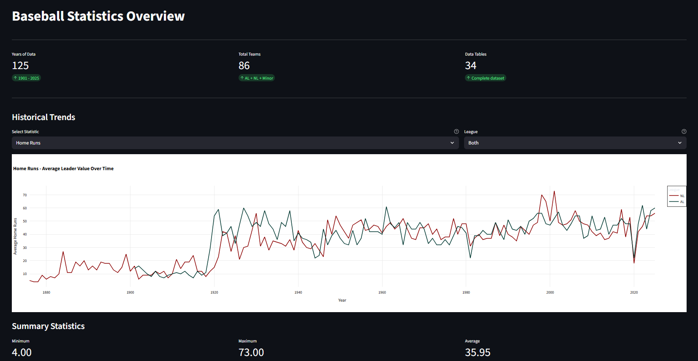
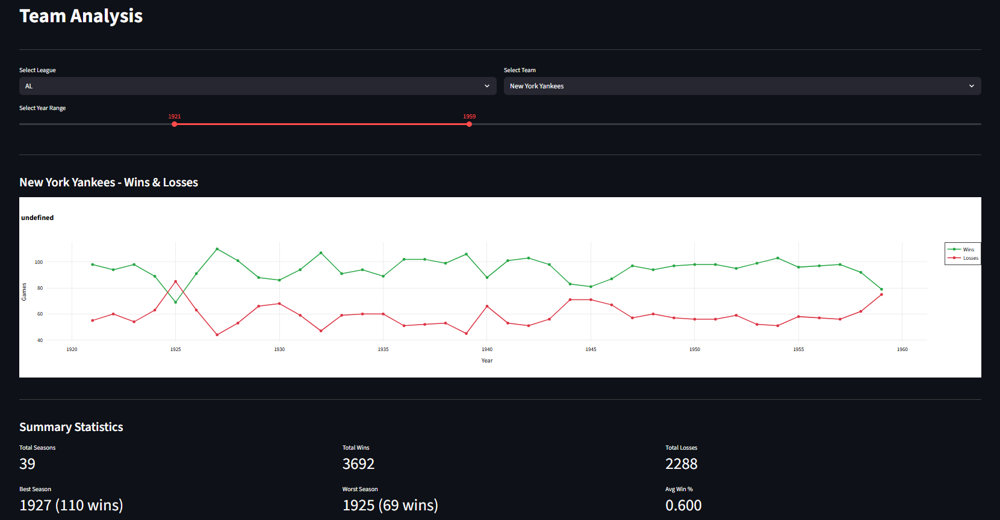
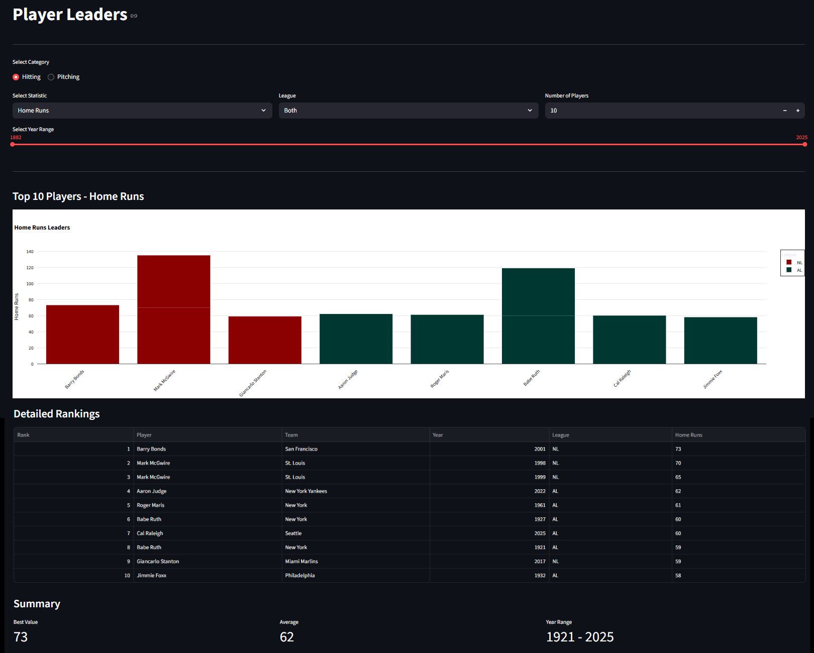
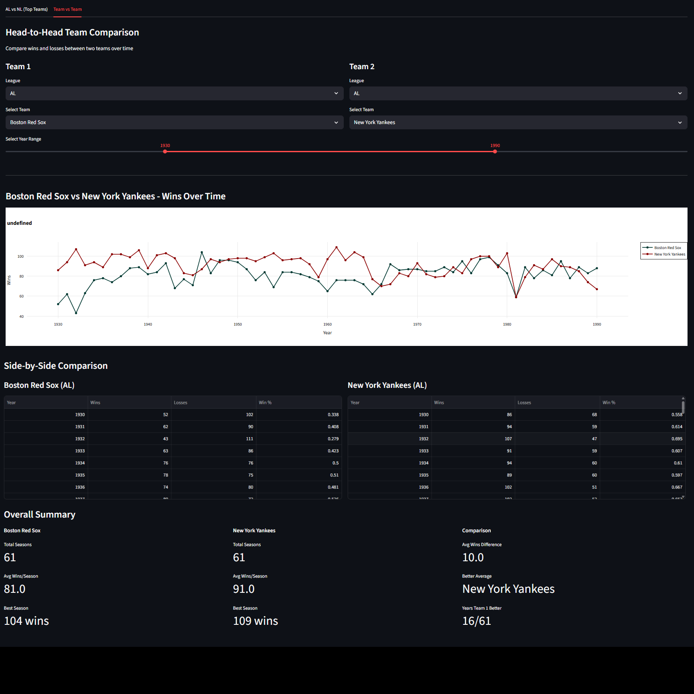

# Baseball Statistics Dashboard

## 🌐 Live Demo

**Live Dashboard:** [https://baseball-scrapping-qwpctcbmwyu52usfxkkevp.streamlit.app](https://baseball-scrapping-qwpctcbmwyu52usfxkkevp.streamlit.app)

A Web scraping and data visualization project that collects, processes, and displays historical baseball statistics from 1876 to 2025, covering American League (AL), National League (NL), and Minor Leagues.

## Project Overview

This project demonstrates a complete data pipeline from web scraping to interactive visualization:

1. **Web Scraping**: Automated data collection using Selenium
2. **Data Cleaning**: Processing and normalizing raw CSV files
3. **Database Management**: SQLite database with optimized queries
4. **Interactive Dashboard**: Streamlit-based web application for data exploration

## Features

### Overview Tab
- Historical trends and evolution of baseball statistics
- Interactive filters for different time periods and leagues
- Key metrics: total years, teams, and data tables



### Team Analysis Tab
- Individual team performance analysis
- Wins/Losses visualization over time
- Summary statistics (best/worst seasons, averages)



### Player Leaders Tab
- Top players by various statistics
- Filtering by category (Hitting/Pitching), league, and time period
- Detailed rankings and comparative visualizations



### Compare Tab
- **AL vs NL**: Compare top teams from each league by year
- **Team vs Team**: Head-to-head historical comparison between any two teams




## 🗂️ Project Structure
```
### Scrapers
common_scraper.py              # Shared scraping functions
scraper_al.py                  # American League scraper
scraper_nl.py                  # National League scraper
scraper_minor.py               # Minor Leagues scraper

### data_processing
data_cleaner.py                # CSV cleaning script
analyze_data.py                # Data quality analysis
migrate_to_db.py               # SQLite database creation
fix_data.py                    # Specific data correction

### database
baseball_stats.db              # SQLite database (3.28 MB)
query_database.py              # CLI query interface

### dashboard/
     └── app.py                # Main dashboard application

### data (CSV files)
   AL_CSV/                        # Raw AL data
   NL_CSV/                        # Raw NL data
   MINOR_CSV/                     # Raw Minor Leagues data
   CLEANED_CSV/                   # Processed data
       ├── AL/                    # Cleaned AL data
       ├── NL/                    # Cleaned NL data
       └── MINOR/                 # Cleaned MINOR data

### screenshots
compare.png                       # Team vs Team
overview_tab.png                  # Statics overview
player_leaders.png                # Top 10 players (Category = "Hitting", Statistic = "Home Runs", League = "Both", Top = 10)
team_analysis.png                 # Data for a team (League = "AL", Team = "New York Yankees", Years = 1921-1959)

requirements.txt                  # Python dependencies
README.md                         # This file
```


## Setup Instructions

### Prerequisites
- Python 3.8 or higher
- Chrome browser (for Selenium)

### Installation

1. **Clone the repository**
```bash
git clone https://github.com/jackie3981/baseball-scrapping.git
cd baseball-scrapping
```

2. **Create virtual environment** (On Windows)
```bash
python -m venv venv
venv\Scripts\activate
```

3. **Install dependencies**
```bash
pip install -r requirements.txt
```

4. **Verify database exists**
The `baseball_stats.db` file should be in the root directory (~3.28 MB). If not, run the migration:
```bash
python migrate_to_db.py
```

### Running the Dashboard

```bash
streamlit run dashboard/app.py
```

The dashboard will open automatically in your browser at `http://localhost:8501`

## Data Pipeline

### 1. Web Scraping
```bash
# Scrape American League data
python scraper_al.py

# Scrape National League data
python scraper_nl.py

# Scrape Minor Leagues data
python scraper_minor.py
```

**Features:**
- Selenium-based automated scraping
- Checkpoint system for resumable scraping
- Duplicate detection and removal
- Error handling and logging

### 2. Data Cleaning
```bash
# Clean all CSV files
python data_cleaner.py

# Analyze data quality
python analyze_data.py

# Fix specific data issues (if needed)
python fix_data.py
```

**Cleaning process:**
- Remove special characters and placeholders
- Standardize decimal formats
- Handle missing values
- Remove duplicates
- Generate before/after reports

### 3. Database Migration
```bash
# Create SQLite database from cleaned CSVs
python migrate_to_db.py
```

**Database features:**
- 34 tables with optimized indexes
- 14,071 total rows
- Data type enforcement (INTEGER, REAL, TEXT)
- NULL value validation

### 4. Query Interface (Optional)
```bash
# Interactive command-line queries
python query_database.py
```

## Database Schema

### Main Tables
- `AL_Team_Standings` / `NL_Team_Standings`: Team records by season
- `AL_Player_Hitting_Leaders` / `NL_Player_Hitting_Leaders`: Top hitters by statistic
- `AL_Pitcher_Leaders` / `NL_Pitcher_Leaders`: Top pitchers by statistic
- `AL_Team_Hitting_Complete` / `NL_Team_Hitting_Complete`: Complete team hitting stats (2002-2004)
- `AL_Team_Pitching_Complete` / `NL_Team_Pitching_Complete`: Complete team pitching stats (2002-2003)

### Minor Leagues Tables
- American Association (AA): 1882-1891
- Federal League (FL): 1914-1915
- Players League (PL): 1890
- Union Association (UA): 1884

## 🎨 Dashboard Features

### Interactive Filters
- **Time Range**: Slider to select year ranges (1876-2025 for AL/NL, 1882-2025 for Minor Leagues)
- **League Selection**: Dropdown to filter by AL, NL, Both, or Minor Leagues
- **Team Selection**: Dynamic team list based on league selection
- **Statistic Selection**: Choose from various hitting and pitching statistics
- **Category Toggle**: Switch between Hitting and Pitching statistics

### Visualizations
- **Line Charts**: Historical trends and team performance over time
- **Bar Charts**: Player rankings and league comparisons
- **Data Tables**: Detailed statistics with rankings and formatting
- **Summary Metrics**: Key statistics displayed as cards

### Design Principles
- Minimalist color scheme (black text, white background)
- Traditional baseball colors (AL: dark green, NL: dark red)
- Responsive layout that adapts to screen size
- Clear labels and tooltips for all interactive elements

## Data Sources

All data scraped from [Baseball Almanac](https://www.baseball-almanac.com/):
- Team standings and records
- Individual player statistics
- League leaders by category
- Historical data from 1876 to 2025

## Technologies Used

- **Python 3.8+**: Core programming language
- **Selenium**: Web scraping automation
- **Pandas**: Data manipulation and analysis
- **SQLite**: Lightweight database
- **Streamlit**: Interactive dashboard framework
- **Plotly**: Interactive data visualizations

## Code Quality
- **Modular Design**: Separate scripts for scraping, cleaning, and visualization
- **Error Handling**: Try-catch blocks with informative error messages
- **Logging**: Detailed logs for all operations
- **Caching**: Streamlit caching for improved performance
- **Validation**: Data quality checks at every stage
- **Documentation**: Inline comments and docstrings

### Testing
- CSV validation reports
- Data quality analysis
- Database integrity checks
- Migration verification

## Known Limitations

1. **Complete Statistics**: Full team statistics (hitting/pitching) only available for 2002-2004
2. **Minor Leagues**: Limited to four historical leagues (AA, FL, PL, UA)
3. **Real-time Updates**: Data is static, requires manual scraping for updates

## 🔮 Future Enhancements

- [ ] Add playoff and World Series data
- [ ] Include player biographical information
- [ ] Add export functionality (PDF reports, CSV downloads)
- [ ] Add more advanced statistics (WAR, OPS+, ERA+)

## Author

**Yoicel Rodriguez Martinez**
- GitHub: @jackie3981(https://github.com/jackie3981)
- Project Link: [https://github.com/jackie3981/baseball-scrapping](https://github.com/jackie3981/baseball-scrapping)

---

**Last Updated**: October 2025  
**Dashboard Status**: Fully Operational  
**Database Size**: 3.28 MB  
**Total Records**: 14,071 rows across 34 tables